# AIPoweredInsightsExtractionEngine 🏗️⛏️

**AI-Powered Insights Extraction Engine** - An advanced document processing and analysis system for mining industry intelligence extraction.

## 🚀 Overview

AIPoweredInsightsExtractionEngine is an advanced RAG (Retrieval-Augmented Generation) pipeline designed to automatically extract, process, and analyze critical information from mining company documents. The platform specializes in processing annual reports, mineral resource statements, and other mining-related documents to extract structured data about production figures, costs, M&A activities, and resource/reserve data.

## ✨ Key Features

- **Multi-Format Document Processing**: Handles both HTML and PDF documents with intelligent content extraction
- **Advanced PDF Analysis**: Extracts text, tables, and images from complex mining reports using PyMuPDF and Camelot
- **JavaScript-Enabled Web Scraping**: Uses Selenium for dynamic content extraction from company websites
- **AI-Powered Data Extraction**: Leverages OpenAI GPT models for intelligent data structuring and topic labeling
- **Chunking & Embedding**: Intelligent text chunking with vector embeddings for semantic search
- **Multiple Vector Stores**: Support for both ChromaDB and FAISS for flexible deployment options
- **Structured Data Models**: Pydantic models for mining-specific data structures (reserves, resources, grades)
- **Workflow Orchestration**: Prefect integration for robust pipeline management
- **Extensible Architecture**: Modular design supporting multiple LLM providers and vector databases

## 🏗️ Architecture

```mermaid
graph TD
    A[🌐 Input Sources] --> B[📄 Document Fetcher]
    A --> C[🔍 Web Scraper]
    
    B --> D{Content Type?}
    C --> D
    
    D -->|PDF| E[📊 PDF Processor]
    D -->|HTML| F[🌐 HTML Parser]
    
    E --> G[📋 Table Extractor<br/>Camelot]
    E --> H[📝 Text Extractor<br/>PyMuPDF]
    E --> I[🖼️ Image Extractor]
    
    F --> J[🔗 Link Extractor<br/>BeautifulSoup]
    F --> K[📝 Text Extractor]
    F --> L[📊 Table Extractor<br/>Pandas]
    
    G --> M[🧩 Text Chunker]
    H --> M
    K --> M
    
    M --> N[🏷️ Topic Labeler<br/>GPT-4]
    N --> O[🔍 Data Extractor<br/>GPT-4]
    
    O --> P[📊 Structured Data<br/>Pydantic Models]
    
    M --> Q[🧠 Embedding Generator]
    Q --> R{Vector Store}
    
    R -->|Option 1| S[🗄️ ChromaDB<br/>+ OpenAI Embeddings]
    R -->|Option 2| T[⚡ FAISS<br/>+ Local LLaMA]
    
    P --> U[💾 JSON Output]
    S --> V[🔎 Semantic Search]
    T --> V
    
    W[🎯 Query Interface] --> V
    V --> X[📈 Intelligence Reports]
    
    Y[⚙️ Prefect Orchestrator] -.-> B
    Y -.-> E
    Y -.-> F
    Y -.-> N
    Y -.-> O
    
    style A fill:#e1f5fe
    style P fill:#f3e5f5
    style U fill:#e8f5e8
    style X fill:#fff3e0
    style Y fill:#fce4ec
```



### Architecture Overview

The platform consists of several key components:

### Core Processing Pipeline (`main.py`)
- Document fetching and content type detection
- HTML parsing with BeautifulSoup
- PDF processing with PyMuPDF and Camelot for table extraction
- Text chunking and embedding generation
- LLM-based topic labeling and data extraction

### Vector Database Options
- **ChromaDB Integration** (`mainopenai.py`): Production-ready vector store with OpenAI embeddings
- **FAISS Integration** (`mainfaiss.py`): High-performance similarity search with local LLaMA models
- **Workflow Orchestration**: Prefect tasks for reliable pipeline execution

### Data Models (`data_models.py`)
Structured Pydantic models for:
- Mining resource and reserve data
- Grade information for different metals
- Mine site and deposit hierarchies
- Document parsing results

## 🛠️ Installation

### Prerequisites
- Python 3.8+
- Chrome/Chromium browser (for Selenium)
- OpenAI API key (for GPT models)

### Setup

1. **Clone the repository**
   ```bash
   git clone https://github.com/yourusername/AIPoweredInsightsExtractionEngine.git
   cd AIPoweredInsightsExtractionEngine
   ```

2. **Create virtual environment**
   ```bash
   python -m venv env
   source env/bin/activate  # On Windows: env\Scripts\activate
   ```

3. **Install dependencies**
   ```bash
   pip install -r requirements.txt
   ```

4. **Environment Configuration**
   Create a `.env` file in the project root:
   ```env
   OPENAI_API_KEY=your_openai_api_key_here
   GROQ_API_KEY=your_groq_api_key_here  # Optional
   ```

## 🚀 Usage

### Basic Document Processing

```python
from main import process_url

# Define topics of interest
topic_definitions = {
    "Company Name": "The official name of the mining company.",
    "Mine Name": "The name of the mine site.",
    "Production Figures": "Annual production figures in tons.",
    "Cost Figures": "Operational and capital costs.",
    "M&A Activity": "Mergers, acquisitions, and investment activity."
}

# Process a mining company document
url = "https://example.com/annual-report.pdf"
process_url(url, topic_definitions)
```

### Running the Full RAG Pipeline

```python
# Using ChromaDB backend
python mainopenai.py

# Using FAISS backend with local LLaMA
python mainfaiss.py
```

### Workflow Orchestration with Prefect

The platform includes Prefect tasks for robust pipeline execution with caching, error handling, and monitoring.

## 📁 Project Structure

```
AIPoweredInsightsExtractionEngine/
├── main.py                 # Core document processing pipeline
├── mainopenai.py           # ChromaDB + OpenAI implementation
├── mainfaiss.py           # FAISS + LLaMA implementation
├── data_models.py         # Pydantic data models
├── 1_downloaded_pdfs/     # Raw PDF storage
├── 2_processed_pdfs/      # Processed document outputs
├── 3_chunked_docs/        # Text chunks with labels
├── 4_vector_db/           # Vector database storage
└── models/                # Local model storage
```

## 🎯 Use Cases

- **Mining Company Analysis**: Extract key metrics from annual reports
- **Resource & Reserve Monitoring**: Track changes in mineral resources over time
- **Market Intelligence**: Analyze M&A activities and market trends
- **Regulatory Compliance**: Process and structure regulatory filings
- **Investment Research**: Due diligence on mining investments

## 🔧 Technical Details

### Document Processing
- **PDF Tables**: Camelot library for accurate table extraction
- **Dynamic Content**: Selenium WebDriver for JavaScript-rendered pages
- **Multi-threaded**: Concurrent processing for improved performance

### AI & Machine Learning
- **Embeddings**: OpenAI text-embedding-ada-002 or local alternatives
- **LLM Integration**: GPT-4 for structured data extraction
- **Vector Search**: Semantic similarity search for relevant document retrieval

### Data Storage
- **Structured Output**: JSON format with mining-specific schemas
- **Vector Storage**: Persistent embedding storage for fast retrieval
- **Metadata Tracking**: Document lineage and processing metadata

## 🤝 Contributing

We welcome contributions! Please see our contributing guidelines:

1. Fork the repository
2. Create a feature branch (`git checkout -b feature/amazing-feature`)
3. Commit your changes (`git commit -m 'Add amazing feature'`)
4. Push to the branch (`git push origin feature/amazing-feature`)
5. Open a Pull Request

## 📄 License

This project is licensed under the MIT License - see the [LICENSE](LICENSE) file for details.

## 🙏 Acknowledgments

- Built with [OpenAI](https://openai.com/) for advanced language processing
- [Camelot](https://camelot-py.readthedocs.io/) for PDF table extraction
- [ChromaDB](https://www.trychroma.com/) and [FAISS](https://github.com/facebookresearch/faiss) for vector storage
- [Prefect](https://www.prefect.io/) for workflow orchestration

## 📞 Contact

For questions or support, please [open an issue](https://github.com/yourusername/AIPoweredInsightsExtractionEngine/issues) or contact me (chrissimusokwe).

---

**AIPoweredInsightsExtractionEngine** - Transforming mining industry documents into actionable intelligence. ⛏️📊
